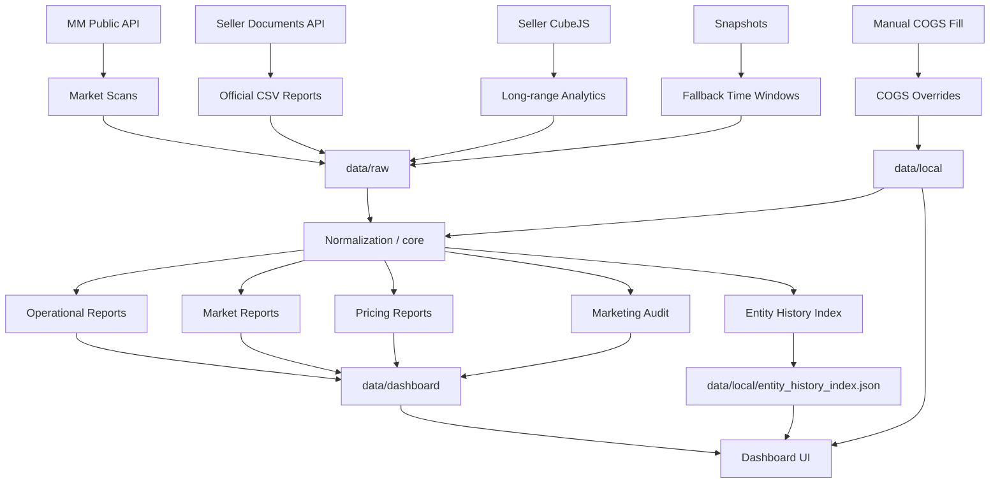
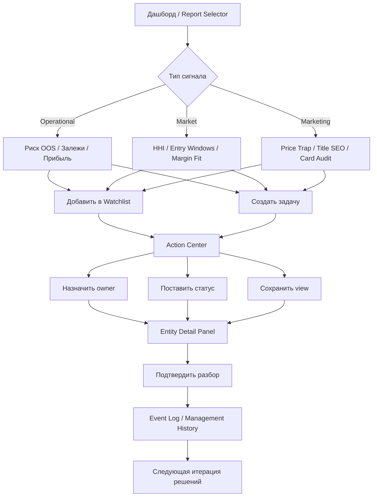

# System Workflows 2026-04-10

## Нужна ли БД

Коротко: да, потребность уже появляется, но не для немедленного big-bang migration.

### Почему уже появляется

- растёт число сущностей:
  - dashboard bundles
  - history
  - action center
  - events
  - cogs overrides
  - saved views
- уже есть stateful workflow, а не только генерация файлов
- нужен более удобный доступ для:
  - history by entity
  - queues by owner/status
  - time-series by report kind
  - dedup / joins / audit trail

### Почему не надо бросаться в БД прямо сейчас

- текущий file-based слой всё ещё понятен и дебажен;
- проект пока mostly single-user/local-first;
- резкий переход на DB легко сломает совместимость и простоту;
- UI и workflow ещё формируются, schema стабилизируется.

### Правильный следующий ход

Не “переписать всё на Postgres”, а сделать staged path:

1. formalize file contracts
2. ввести repository layer
3. подготовить optional SQLite backend
4. сначала перенести stateful слои:
   - action center
   - entity history
   - cogs overrides
   - saved views
5. отчёты и dashboard bundles пока оставить file-first

### Вывод

Да, БД станет удобнее для меня и для продукта.

Но сейчас оптимален не full migration, а:

- `JSON files as canonical reports`
- `SQLite as optional state/query layer`

## Схема получения данных и формирования отчётов

## Схема управленческих действий на основе дашборда

## Что делать дальше

Следующий логичный продуктовый шаг:

1. repository layer
2. optional SQLite
3. entity manager pages
4. queues by owner/status/view
